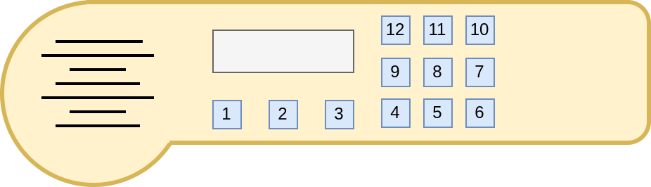
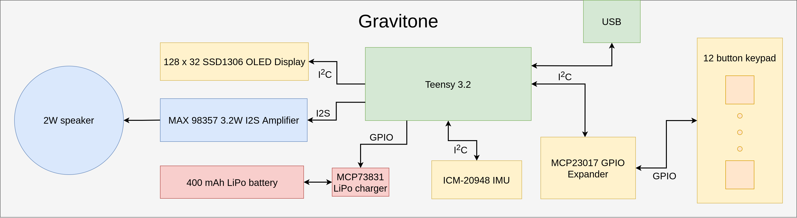

# Gravitone_ArduinoLibrary

Support code and examples for the Gravitone.


## Quick start

If you want to reconfigure the Gravitone yourself and change the way it converts motions to sound, then follow these steps.

- Install the Arduino IDE https://www.arduino.cc/en/software
- Install Teensyduino https://www.pjrc.com/teensy/td_download.html
- Install the Gravitone_ArduinoLibrary library. The easiest way is through the built in library manager. Go to the Sketch menu, then Include Library then Manage libraries. More information here: https://docs.arduino.cc/software/ide-v1/tutorials/installing-libraries

- ***IMPORTANT***: you must edit a source file in the Sparkfun ICM-20948 IMU library (```ICM_20948_C.h```) in order to fully enable high accuracy motion tracking. More information on this process here: https://github.com/sparkfun/SparkFun_ICM-20948_ArduinoLibrary/blob/main/DMP.md#is-dmp-support-enabled-by-default

- Now open the Modes Example. Go to File -> Examples -> Gravitone_ArduinoLibrary -> ModesExample
- Plug the Gravitone into the computer and turn it on
- Click Upload


## Buttons and control

This section explains the button functionality for the two modes used in the ModesExample mentioned above.

### Power on calibration
When you turn on the Gravitone, it is best to hold buttons down until it makes a beep after fully booting up.

The two default output modes are scale mode and wave mode, both of which are "output modes". This means they both use buttons 2 and 3 for volume control, unless you hold button 1 which then acts as a mode switch



On all example output modes, buttons 1 through 3 have the following functionality:

1: Mode switch

2: Volume down

3: Volume up

## Modes
The two default modes are scale mode and wave mode which both offer an entertaining variety of features. 

To switch modes, hold down button 1 and press button 2 or 3. When button 1 is pressed buttons 2 and 3 have the following functionality:

2: Previous mode

3: Next mode


### Scale mode
Scale mode offers a variety of 

4: Play a note based on the **pitch** of the device

5: Play a note based on the **roll** of the device

6: Play both notes controlled by **pitch** and **roll** 

7: Toggle between fretless and fretted scales

8: Play vibrato applied to the note based on **roll**

9: Play vibrato applied to the note based on **pitch**

10: Change scale type (Blues, major, minor, etc.)

11: Change key (G, D, A, etc)

12: Switch between a sine and sawtooth waveform


### Wave mode
4: Play a waveform whos frequency is mapped to the **pitch** of the device

5: Play a waveform whos frequency is mapped to the **roll** of the device

6: Play a waveform whos frequency is mapped to the **heading** of the device

7: Play a waveform whos frequency is mapped to the **pitch** and **heading** of the device

8: Play a waveform whos frequency is mapped to the **roll** and **heading** of the device

9: Play a waveform whos frequency is mapped to the **pitch** and **roll** of the device

10: Switch between sine and sawtooth waveforms

11: Sets the tone of the mode. Aim the Gravitone towards the floor and press this button to lower the overall pitch of all the oscillators.

12: Play all three waveforms at once


## Hardware details
Below is a block diagram of the hardware of the Gravitone. 




## Library architecture and driver design
This section outlines the design of the library and the how to create modes and use the **GravitoneHardware** driver to access buttons and IMU data from the Gravitone's sensors.

The purpose of the the **GravitoneHardware** driver is to abstract away all of the details of this block diagram and give the end user and easy way to access device functionality.


#### The Teensy Audio Library
The Teensy Audio library is an amazing collection of software written by Paul Stoffregen and other community contributors. There is GUI tool to design and route audio systems https://www.pjrc.com/teensy/gui/. 
