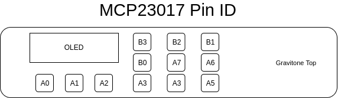
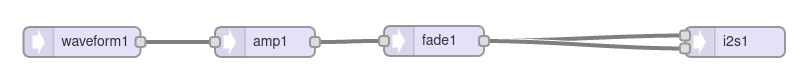
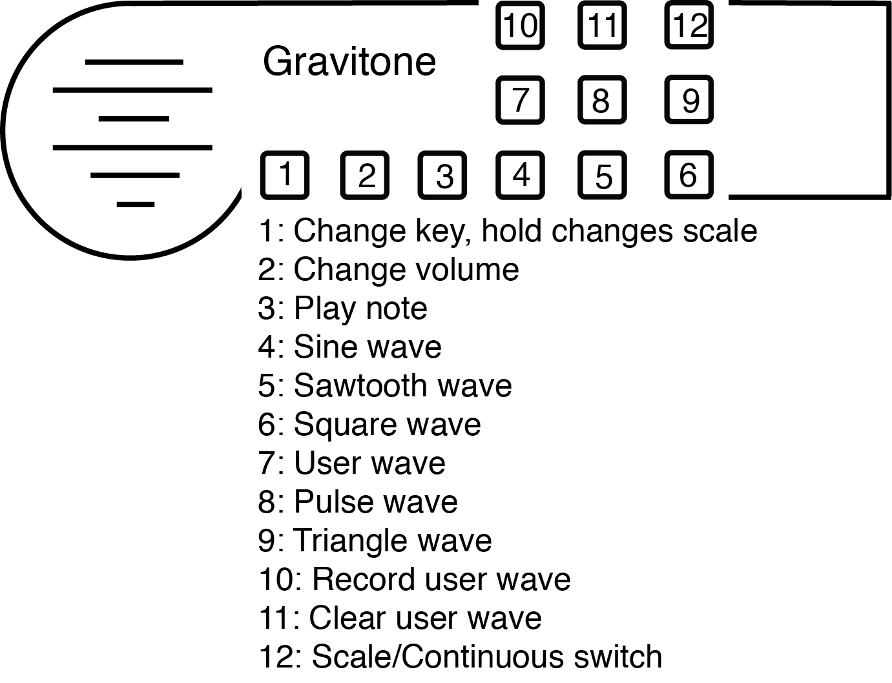
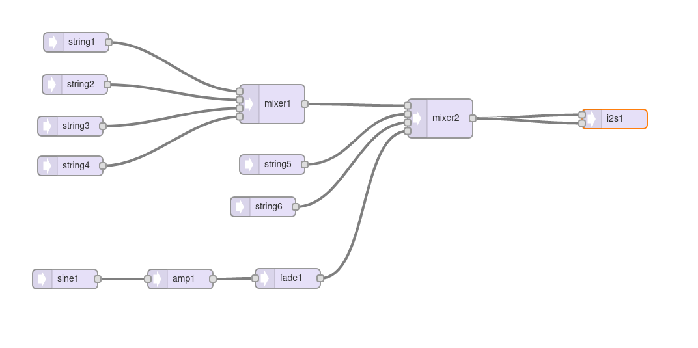

# Gravitone_ArduinoLibrary
Arduino library for the Gravitone spatial synthesizer kit

So you have a Gravitone, and now you want to play with the software. Read along below to get the necessary development environment and dependencies setup and installed. 

This repository is a WIP and will be updated continually to improve the user experience and flexibility of developing with the Gravitone. 

Planned work on the library includes:
- general improvement and adherence to OOP principles
- development of a Gravitone class to contain subsystem update timestamps
- GravitoneMode class to contain UI params such as button functionality and menu display
- encapsulation of IMU reading and orientation filtering
- button functionality improvement with user defined callback functions
- incorporation of a navigable menu system to change button mappings
- possibly dynamically creating AudioStream objects for reconfiguration of Audio library configuration on the fly.

## Installation
This section describes installing the IDE and libraries needed to build the Gravitone library. If you already have these setup, proceed to installing libraries.
### Installing Arduino and TeensyDuino
- Install a distribution of the [Arduino Development Environment](https://www.arduino.cc/en/Main/Software) (1.8.12 is a good version for compatibility with TeensyDuino
- Install TeensyDuino, from PJRC, for your OS. (https://www.pjrc.com/teensy/teensyduino.html) When prompted which libraries to install during the TeensyDuino installation, choose ALL.

### Installing Libraries
In the Arduino IDE menu, choose Sketch -> Include Library -> Manage Libraries, then search for and install the following libraries:
 
- MadgwickAHRS
- Adafruit_GFX
- Adafruit_SSD1306
- Adafruit-MCP23017-Arduino-Library
- Sparkfun ICM-20948 Library
 
### Install the Gravitone_ArduinoLibrary
 Download this repository as a ```.zip``` file and import to the Arduino IDE using Sketch -> Include Library -> Import .zip Library

## Using the Teensy Audio Library
If you are not already familiar with it, the Teensy Audio library is an amazing collection of software written by Paul Stoffregen and other community contributers. There is GUI tool to design and route audio systems [here](https://www.pjrc.com/teensy/gui/). It is worth noting that the speaker on the Gravitone is powered by a MAX98357A I2S amplifier, so on all valid audio system designs for the Gravitone, there must be an I2S output endpoint.

## Button Mapping
The Gravitone uses an I2C GPIO expander to access buttons. Button indices are assigned by referencing the following diagram and ```enum ``` in ```src/GravitoneButton.h```.


``` c
// BUTTON CONNECTIONS w.r.t. TO MCP23017
enum GravitoneButton {
    GPIN_A0,
    GPIN_A1,
    GPIN_A2,
    GPIN_A3,
    GPIN_A4,
    GPIN_A5,
    GPIN_B0,
    GPIN_A7,
    GPIN_A6,
    GPIN_B3,
    GPIN_B2,
    GPIN_B1
};
```

A numbered diagram labeling physical buttons to this enumeration is shown below in the section about the Theremin example.

## Examples
Examples are accessible throught the Arduino Examples menu and showcase several different uses of the Gravitone.


### Theremin

A video description of this example, which offers the ability to play multiple types of scales in different keys, along with different wave types, is available at [https://youtu.be/qHYnYlFuf40](https://youtu.be/qHYnYlFuf40). The audio connection diagram and button description for this example are shown below.








### Guitar
 Currently there is one example, the Guitar example. This demo project has code for reading the IMU and converting the orientation into notes of a scale, as well as some basic UI features for battery and volume. The 3x3 button pad in this example is mapped to chords. 
 
 
Lets look at the audio system design layout for the Guitar example.

This uses individual string synthesis objects and assigns them the corresponding note frequency of a single note of a guitar chord, the triggers each of the successively to create a guitar strum. This example uses code and ideas from the Teensy Audio libraries guitar example.
