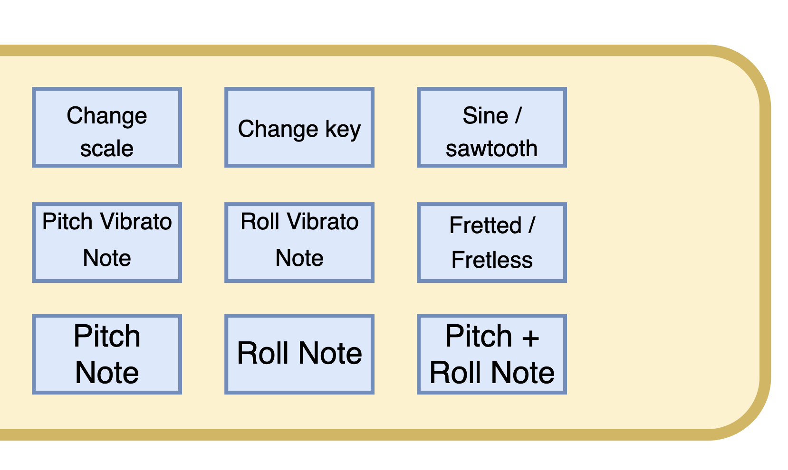
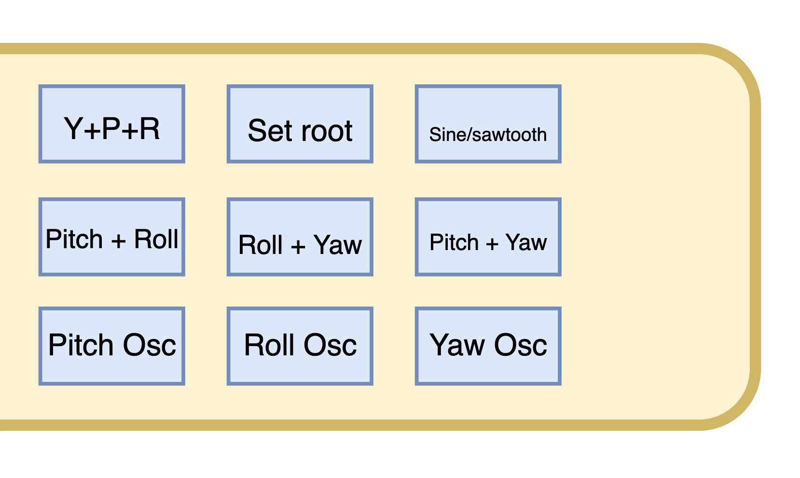
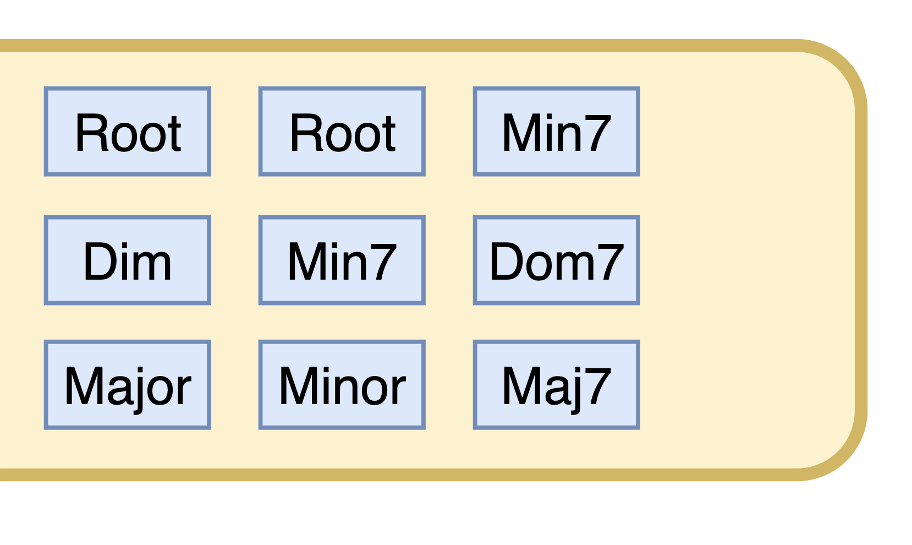

# Gravitone_ArduinoLibrary

Support code and examples for the Gravitone.


## Quick start

If you want to reconfigure the Gravitone yourself and change the way it converts motions to sound, then follow these steps.

- Install the Arduino IDE https://www.arduino.cc/en/software
- Install Teensyduino https://www.pjrc.com/teensy/td_download.html
- Install the Gravitone_ArduinoLibrary library. The easiest way is through the built in library manager. Go to the Sketch menu, then Include Library then Manage libraries. More information here: https://docs.arduino.cc/software/ide-v1/tutorials/installing-libraries

- ***IMPORTANT***: you must edit a source file in the Sparkfun ICM-20948 IMU library (```ICM_20948_C.h```) in order to fully enable high accuracy motion tracking. More information on this process here: https://github.com/sparkfun/SparkFun_ICM-20948_ArduinoLibrary/blob/main/DMP.md#is-dmp-support-enabled-by-default

- Now open the Modes Example. Go to File -> Examples -> Gravitone_ArduinoLibrary -> ModesExample
- Plug the Gravitone into the computer and turn it on
- Click Upload


## Buttons and control

When you turn on the Gravitone, it is best to hold the Gravitone upside down until it makes a beep after fully booting up, otherwise it will take about 25 seconds for the motion sensor to stabilize.

There are three default output modes: scale mode, wave mode, and xylotar mode, all of which are "output modes". This means they both use buttons 2 and 3 for volume control, unless you hold button 1 in which case buttons two and three arrow between modes.


On all example output modes, buttons 1 through 3 have the following functionality:

1: Mode switch

2: Volume down

3: Volume up

In all of the modes, the following rotation convention is used when referencing yaw pitch and roll.


## Modes
To switch modes, hold down button 1 and press button 2 or 3. When button 1 is pressed buttons 2 and 3 have the following functionality:

2: Previous mode

3: Next mode


### Scale mode
Scale mode allows the user to play notes of many musical scales mapped to the device orientation, and also play them simulataneuously. The vibrato buttons allow for bending the each note when the Gravitone is shaken on the opposite axis (side-to-side if playing a pitch note, and front to back if playing a roll note).



4: Play a note based on the **pitch** of the device

5: Play a note based on the **roll** of the device

6: Play both notes controlled by **pitch** and **roll** 

7: Toggle between fretless and fretted scales

8: Play vibrato applied to the note based on **roll**

9: Play vibrato applied to the note based on **pitch**

10: Switch between a sine and sawtooth waveform

11: Change key (G, D, A, etc)

12: Change scale type (Blues, major, minor, etc.)


### Wave mode
This mode uses three separate oscillators each controlled by the yaw/pitch/roll of the device, and allows the user to play them in different polyphonic combinations. Switching between sine and sawtooth modes is also supported, as well as the set root button. The set root button changes the root note of all three oscillators.




4: Play a waveform whos frequency is mapped to the **pitch** of the device

5: Play a waveform whos frequency is mapped to the **roll** of the device

6: Play a waveform whos frequency is mapped to the **heading** of the device

7: Play a waveform whos frequency is mapped to the **pitch** and **heading** of the device

8: Play a waveform whos frequency is mapped to the **roll** and **heading** of the device

9: Play a waveform whos frequency is mapped to the **pitch** and **roll** of the device

10: Switch between sine and sawtooth waveforms

11: Sets the tone of the mode. Aim the Gravitone towards the floor and press this button to lower the overall pitch of all the oscillators.

12: Play all three waveforms at once

### Xylotar mode

Xylotar mode plays a synthesized plucking of a guitar string when the Gravitone is struck in a hammer-like motion similar to the motion one makes when playing a xlylophone. 



4: Major chord

5: Minor chord

6: Major 7th chord

7: Dominant 7th chord

8: Minor 7th chord

9: Diminished chord

10: Minor 7th chord

11 or 12: Single note root of chord

## Hardware details
Below is a block diagram of the hardware of the Gravitone. 


## Library architecture and driver design
This section outlines the design of the library and the how to create modes and use the **GravitoneHardware** driver to access buttons and IMU data from the Gravitone's sensors. The purpose of the the **GravitoneHardware** driver is to abstract away all of the details of this block diagram and give the end user and easy way to access device functionality. 

Documentation of this and other libary classes including Modes and OutputModes is available at [https://movetones.github.io/Gravitone_ArduinoLibrary/](https://movetones.github.io/Gravitone_ArduinoLibrary/).


#### The Teensy Audio Library
The Teensy Audio library is an amazing collection of software written by Paul Stoffregen and other community contributors. There is GUI tool to design and route audio systems https://www.pjrc.com/teensy/gui/. 
