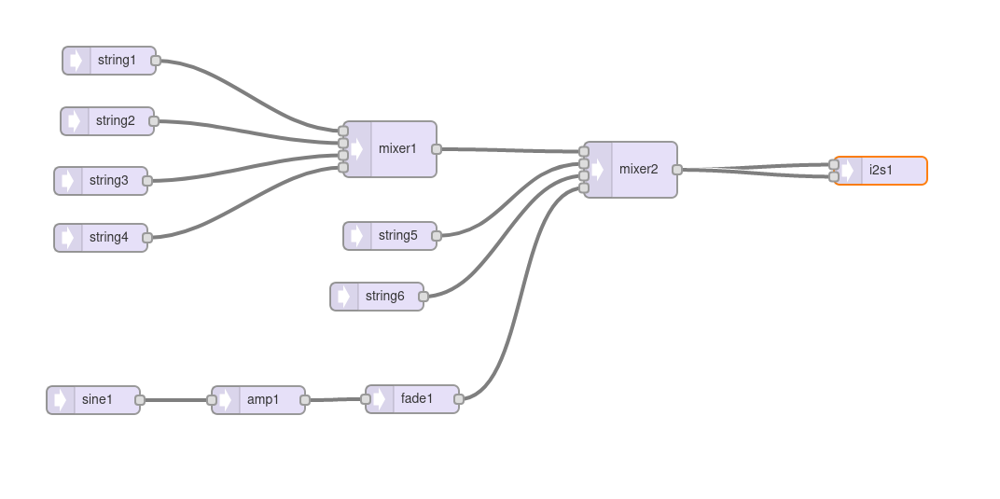

# Gravitone_ArduinoLibrary
Arduino library for the Gravitone spatial synthesizer kit

So you have a Gravitone, and now you want to play with the software. Read along below to get the necessary development environment and dependencies setup and installed. 

## Installation
This section describes installing the IDE and libraries needed to build the Gravitone library. If you already have these setup, proceed to installing libraries.
### Installing Arduino and TeensyDuino
- Install a distribution of the [Arduino Development Environment](https://www.arduino.cc/en/Main/Software) (1.8.12 is a good version for compatibility with TeensyDuino
- Install TeensyDuino, from PJRC, for your OS. (https://www.pjrc.com/teensy/teensyduino.html) When prompted which libraries to install during the TeensyDuino installation, choose ALL.

### Installing Libraries
- In the Arduino IDE menu, choose Sketch -> Include Library -> Manage Libraries.
- Search for and install the following libraries:
 - MadgwickAHRS
 - Adafruit_GFX
 - Adafruit_SSD1306
 - Adafruit-MCP23017-Arduino-Library
 - Sparkfun ICM-20948 Library
 
### Install the Gravitone_ArduioLibrary
 Download this repository as a ```.zip``` file and import to the Arduino IDE using Sketch -> Include Library -> Import .zip Library

## Using the Teensy Audio Library
If you are not already familiar with it, the Teensy Audio library is an amazing collection of software written by Paul Stoffregen and other community contributers. There is GUI tool to design and route audio systems [here](https://www.pjrc.com/teensy/gui/). The gravitone uses an I2S amplifier, so tp build a project in this GUI to be compatible with the Gravitone, the only manditory inclusion is an 'I2S Output' block. 

Lets look at the audio system design layout for the Guitar example thats included with the Gravitone library.


## Examples
 Currently there is one example, the Guitar example. This demo project has code for reading the IMU and converting the orientation into notes of a scale, as well as some basic UI features for battery and volume. The 3x3 button pad in this example is mapped to chords. 

